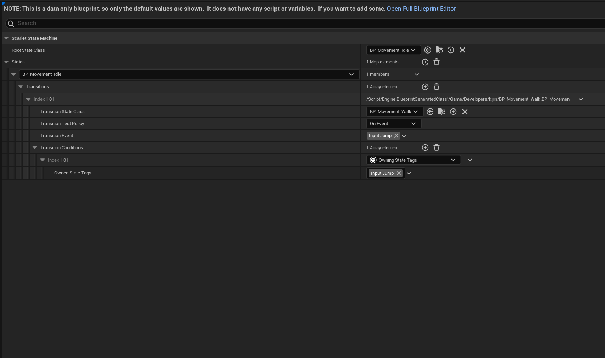

<a href="https://github.com/kijin-Kim/Scarlet/tree/master/Source/Scarlet/Core/FSM" rel="nofollow noopener noreferrer"><i class="fab fa-fw fa-github fa-3x" aria-hidden="true"></i></a>

# 유한 상태 기계(FSM) 구현 문서

## 개요
이 문서는 언리얼 엔진으로 구현한 유한 상태 기계(Finite State Machine, FSM)에 대한 기술적인 내용을 담고있습니다.

## 1. 구성요소
- **State:** State Machine에서 가장 작은 단위로 특정 동작/상태에 대한 로직과 입장/퇴장에 대한 로직을 가지고 있습니다.
- **State Machine:** 현재 State에 대한 로직을 매 틱마다 수행하고, 다른 State으로의 전환 로직을 처리합니다.
- **State Machine Component:** 여러 개의 State Machine을 관리하며, 각각의 State Machine은 독립적으로 동작합니다.
- **Transition Condition:** State 간의 전환 로직으로 State와 별도로 존재하며, State Machine에 의해 관리됩니다.

## 2. 동작 과정
1. State Machine은 게임이 시작되면, 설정된 State Machine들의 정보를 바탕으로, State Machine을 인스턴스화하고
각각의 State Machine의 OnBeginPlay 함수를 호출합니다.
2. State Machine은 OnBeginPlay함수가 불리면 EnterNewState함수를 호출하여 Root State(최초 시작 상태)를 현재 상태로 만듭니다.
3. EnterNewState에서는 현재 상태를 인스턴스화하고 Root State에 대한 Enter함수를 부르고 전환 로직 테스트 정책이 On Event인 컨디션에 대하여, 컨티션이 만족시
다른 상태로 전환 될 수 있도록 델리게이트를 바인딩합니다.
4. State Machine은 현재 상태에 대해 지속적으로 Tick함수를 호출하고, 전환 로직 테스트 정책이 On Tick인 컨티션에 대하여 매 틱마다 검사를 진행합니다.

## 3. 에디터 설정
다음은 State Machine의 블루프린트에 대한 설명입니다. 

- Root State Class: 최초의 상태머신의 시작 상태의 클래스를 나타냅니다.
- States: 각각의 상태의 전환 로직에 대한 설정 항목입니다.
  - Transition State Class: 아래 로직에 의해 전환할 상태의 클래스를 나타냅니다.
  - Transition Test Policy: 전환 로직을 테스트하는 정책을 나타냅니다. On Tick일 경우 매 틱마다 전환할 수 있는지 전환 로직을 평가하고, On Event일 경우 StateMachine의 DispatchEvent함수를 통해 지정된 GameplayTag를 받을 때마다 전환 로직을 평가합니다.
  - Transition Event: Transition Test Policy가 On Event일 경우에만 활성화 됩니다. 여기서 지정된 이벤트가 발생될 때마다 전환 로직이 평가됩니다.
  - Transition Condition: 전환 로직에 대한 Instanced Property입니다. 전환 로직 정책에 따라 평가 빈도가 결정됩니다.

